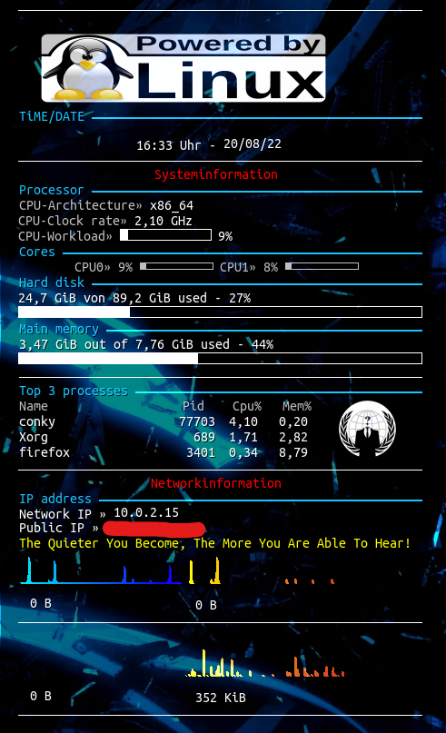

:sparkles::sparkles::sparkles: HEY THERE :trollface: :sparkles::sparkles::sparkles:
==============================================

-~ My current conky config [.EN] ~-

:heavy_exclamation_mark:ENGLiSH VERSiON:heavy_exclamation_mark:

I was annoyed because many configs didn't work for me. So I decided to make my own ✌️.

It is just a simple conky config without a lot of extras but it's enough for me.

You don't need to install any font in your system!

I tested this config only on a virtual machine with Manjaro XFCE!

The background on this screenshot is a blue kali dragon :)

### How to install? ###

Arch:
sudo pamac install conky
maybe you have to install conky-colors-git as well

Debian:
sudo apt-get install conky-all

:point_right: git clone https://github.com/eClipZe88/MyConkyConfigEN.git

:point_right: cd MyConkyConf

:point_right: cp -rf conkyrc $HOME/.conkyrc

:point_right: cp -rf anonymous.png powered_by_linux.svg.png ip.sh $HOME/.conky

:point_right: -> maybe you have to play with the resolutions of the PNG files.

:point_right: finally start conky 
conky -c ~/.conkyrc & 

or use my start-conky.sh

### :point_up_2:PLEASE NOTE:point_up_2: ###
If you have more than two cores then you have to add them manually. A sample is at line 60.
For a better look use a dock (e.g. plank) and move the (task)bar to the top of the screen.

ENJOY(●'◡'●) 

